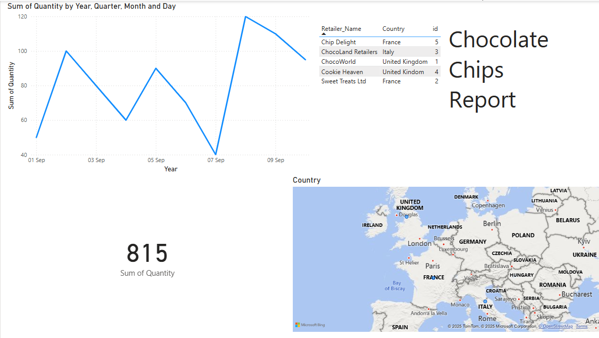
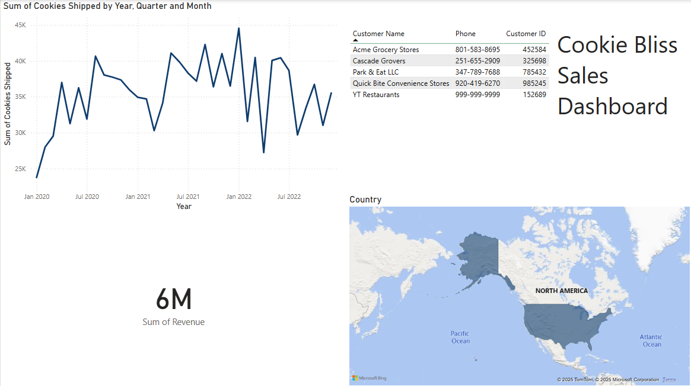

# Cookie Sales Analysis – Power BI Portfolio

📊 This repo contains three Power BI reports I built while learning and applying data analytics concepts. The final product, *Emma's Report*, is a fully interactive executive dashboard focused on cookie sales performance.

---

## 🔧 Tools Used

* Microsoft Power BI
* Power Query (ETL)
* DAX (Basic Calculations)
* Visualization: KPIs, Slicers, Line/Bar Charts

---

## 📁 Reports Overview

### 1️⃣ cookiesReport (Study Exercise)

* Simple bar charts and line graphs
* Early exploration of monthly sales data
* Focused on understanding filters and visuals

### 2️⃣ chocolateChip (Practice Report)

* Introduced KPIs, slicers, and dynamic visuals
* Added custom DAX measures and improved layout
* Filterable by region and product category

### 3️⃣ EmmasReport (Final Project)

* Executive dashboard for sales managers
* Clean layout with time filter, KPIs, and insights
* Shows sales trends, category breakdown, and top SKUs

---

## 📷 Screenshots

| Report        | Preview                                     |
| ------------- | ------------------------------------------- |
| EmmasReport   |           |
| chocolateChip |            |
| cookiesReport |  |

---

## 📜 Certificate

[Power BI for Beginners – Certificate of Completion](https://coursera.org/share/48a38c237198edf41be0c7fcc7bee618C)

---

## 🧠 Key Learnings

* Connected and transformed real-world business data
* Created dashboards tailored to stakeholder needs
* Built confidence using DAX and storytelling with visuals
